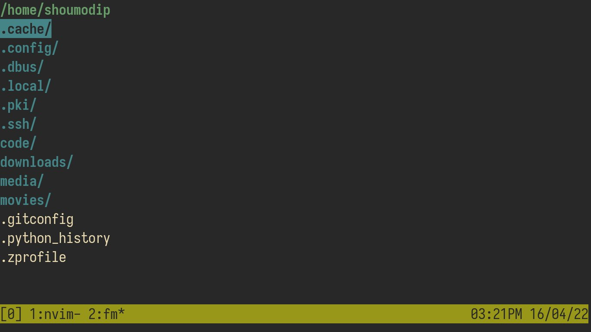

# Fm
A WIP File Manager



## Quick Start
```console
$ go install
$ fm
```

## Usage
| Key | Description                                     |
| --- | ----------------------------------------------- |
| `j` | Move cursor down                                |
| `k` | Move cursor up                                  |
| `h` | Enter Parent Directory                          |
| `l` | Enter Directory under cursor                    |
| `/` | Search for items                                |
| `?` | Search for items backwards                      |
| `n` | Find the next match for the previous search     |
| `N` | Find the previous match for the previous search |
