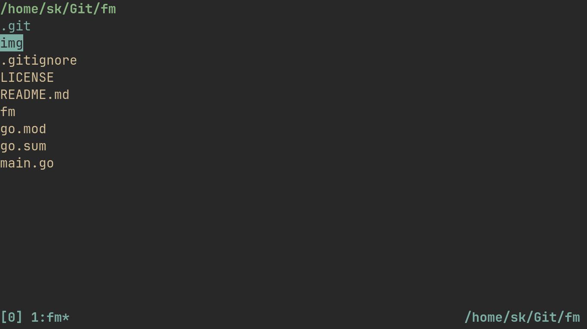

# Fm
Simple File Manager in Go



## Quick Start
```console
$ go install
$ fm
```

## Usage
| Key          | Description                                          |
| ------------ | ---------------------------------------------------- |
| <kbd>j</kbd> | Move the cursor down                                 |
| <kbd>k</kbd> | Move the cursor up                                   |
| <kbd>}</kbd> | Move the cursor 10 items down                        |
| <kbd>{</kbd> | Move the cursor 10 items up                          |
| <kbd>g</kbd> | Move the cursor to the top                           |
| <kbd>G</kbd> | Move the cursor to the bottom                        |
| <kbd>h</kbd> | Enter Parent Directory                               |
| <kbd>l</kbd> | Enter item under the cursor                          |
| <kbd>e</kbd> | Open item under the cursor with `$EDITOR`            |
| <kbd>o</kbd> | Open item under the cursor with arbitrary program    |
| <kbd>/</kbd> | Search for items                                     |
| <kbd>?</kbd> | Search for items backwards                           |
| <kbd>n</kbd> | Find the next match for the previous search          |
| <kbd>N</kbd> | Find the previous match for the previous search      |
| <kbd>d</kbd> | Create a directory                                   |
| <kbd>f</kbd> | Create a file                                        |
| <kbd>x</kbd> | Toggle mark for the item under the cursor            |
| <kbd>X</kbd> | Toggle marks in the current directory                |
| <kbd>D</kbd> | Delete marked items, otherwise item under the cursor |
| <kbd>m</kbd> | Move marked items into the current directory         |
| <kbd>c</kbd> | Copy marked items into the current directory         |
| <kbd>r</kbd> | Rename item under the cursor                         |
| <kbd>~</kbd> | Goto `$HOME`                                         |
| <kbd>.</kbd> | Goto the directory `fm` was opened in                |
| <kbd>-</kbd> | Goto the previous active directory                   |
| <kbd>H</kbd> | Show this help popup                                 |

Vim-esque `N<Action>` also works, like `69j`, `420x`, `1337D`, etc.

## Open Fm in a different directory
```console
$ fm -init-path <path>
```

## Use Fm to change directory
```console
$ cd $(fm -last-path)
```

You can bind it to a shortcut key, for convenience.

```zsh
# .zshrc

fmcd() {
    cd $(fm -last-path)
}

bindkey -s "^o" "^ufmcd\\n"
```
